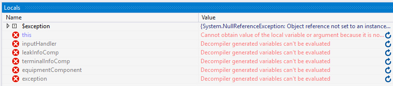
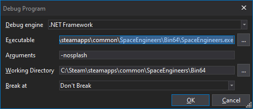

These are if you're already a bit comfortable with what [dnSpy](Advanced-debugging-with-dnSpy#getting-dnspy) is and how to use its [decompiled code navigation](Advanced-debugging-with-dnSpy#looking-at-the-compiled-code) and [basic debugging](Advanced-debugging-with-dnSpy#catching-errors-exceptions).

## Breakpoints

These pause the code execution at a specific line just like exceptions, but you don't need an error or to edit the code to do it, just right-click on any code line to add a breakpoint.

When dnSpy is attached and the game goes over your breakpoints it will pause the execution just like an exception (relevant: [Navigating paused code](Advanced-debugging-with-dnSpy#navigating-paused-code)).

##### Breakpoints for PB/mod scripts.

Mods and PB scripts are compiled in memory and can be found in Debug -> Windows -> Modules (Ctrl+Alt+U, requires dnSpy to be attached) at the end, PB scripts have `<EntityId>-<CustomName>.dll` name format.

**Note:** When you recompile a PB or reload a world the scripts are compiled into *new modules*, that means you need to open the new one and add/move your breakpoints there.  
Or you can avoid that assembly/module fiddling and just throw exceptions inside a try-catch in your own code to act like a breakpoint:  
`try { throw new InvalidOperationException("break my point") } catch(Exception) {}` (relevant: [Catching errors (exceptions)](Advanced-debugging-with-dnSpy#catching-errors-exceptions)).  
**Warning:** This is NOT normal code but merely a trick for debugging, you should not be ignoring real exceptions with an empty catch block like above.

## Seeing local variables when code is paused

Local variables are optimized out so in order to see their values when execution is paused you need to have the libraries start as unoptimized.

Simply attaching dnSpy to the game will cause any future in-game compilations to be built unoptimized for the duration of the game session, that means you don't need to launch the game from dnSpy to debug PB/mod code effectively. (mods recompile on world load, PBs can be recompiled in terminal)

For game's local variables to have readable values you need to start the game with dnSpy in order to load its libraries as unoptimized, see below on how to properly do that.

**Note:** Starting the game with dnSpy will run noticeably slower.

##### Starting the game with dnSpy:

1. Download: [steam_appid.txt](binaries/steam_appid.txt) as a file

2. Place `steam_appid.txt` in the game's Bin64 (e.g. `<Steam>/SteamApps/common/SpaceEngineers/Bin64`)

3. Start dnSpy (but not the game).

4. dnSpy: `Debug -> Start Debugging (F5)`

5. In the Executable field press `[...]` and go to game's Bin64 again and pick SpaceEngineers.exe

   Optional: add `-skipintro -nosplash` in the Arguments field.

   

6. Do your exception catching or breakpoint stuff.

7. Local variables now have values!

***

_A big thank you goes to Digi for writing this tutorial._