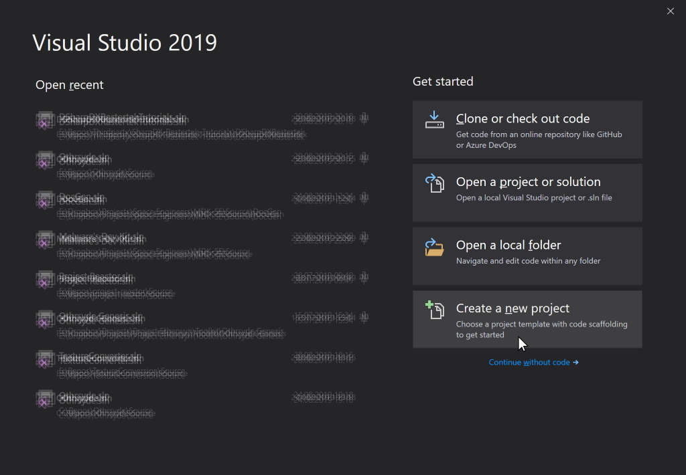
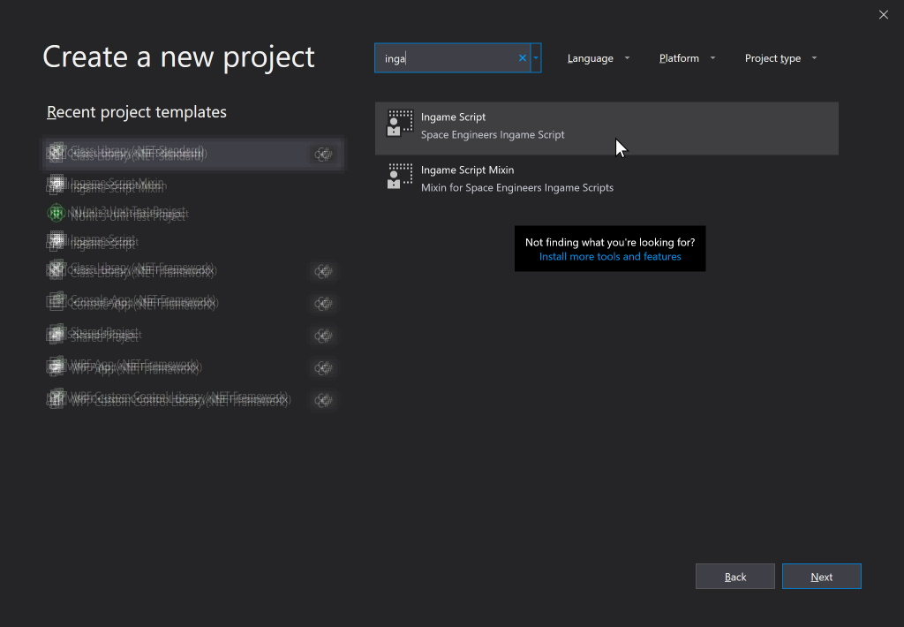
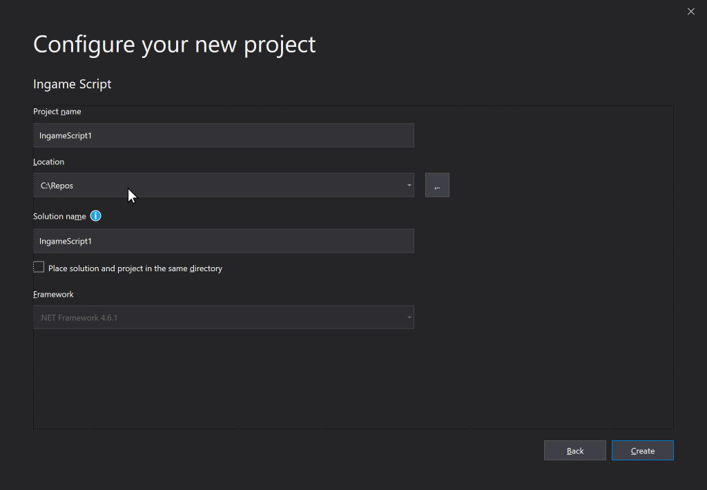

### Step 1
First of all, obviously, you need to make sure you have installed Visual Studio 2019. **Note: MUST be 2019, as 2022 is not supported.** This will work with all editions, but the Community edition is completely free. You can find instructions on how to install that here. For Space Engineers development you need at least the **.NET desktop development** workload. You will also need to make sure you check the **.NET Framework 4.8 Targeting Pack** in the Individual Components section of the Visual Studio Installer.

https://docs.microsoft.com/en-us/visualstudio/releases/2019/release-notes  
https://www.visualstudio.com/vs/getting-started/

Note: Visual Studio 2017 is no longer supported.  Visual Studio 2019 is required. 2022 is not yet supported.

### Step 2
Download the extension from here:
https://github.com/malware-dev/MDK-SE/releases

In most circumstances you will be interested in downloading the file named **MDK.vsix**. This is a installer package format used by Visual Studio to install extensions. Double-click it to install it - _after_ installing Visual Studio.

You should stay away from any pre-release builds unless you know what you're doing, or if you are kind enough to want to help me test. Just be aware that pre-release builds are bound to be particularly buggy, and might even break script projects, so you certainly shouldn't use them for your more complicated scripts.

### Step 3

After installing the extension, you can now start Visual Studio and create your script project. You will be presented with the Visual Studio splash screen. To begin, click the `Create a new project` button.

After this you can search for `ingame script` in the search box, and select the `Ingame Script` template.

Now you can select your project's location and names in the boxes below.

Note the `Location` box. That is where your solution and project will be stored on disk: Visual Studio will add a subfolder there with the name of your solution, and below there it will create a `.sln` file. Make note of this file, because _this_ is the file you need to open when you're going back to your project later, not the individual `.cs` files.

Press **OK** to create your project.

You may now write your script directly in this class if you wish. If your scripts are not too large, this is quite fine. However this extension has another couple of [tricks up its sleeve](https://github.com/malware-dev/MDK-SE/wiki/Utility-Class-or-Extension-Class) for the slightly more advanced users.

### Step 4

If you need to, you can find an [introduction to ingame scripting](Quick-Introduction-to-Space-Engineers-Ingame-Scripts) and an [autogenerated API listing](Api-Index) on this site as well.

Happy Scripting!